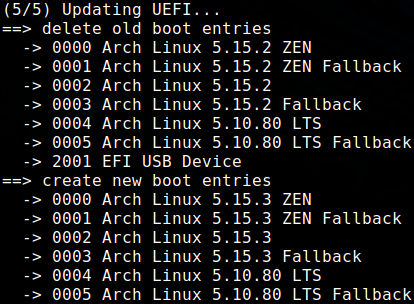

# efistub

shell script to create efi boot entries with efibootmgr

| folder name | comment                                                                 |
| :---------- | :---------------------------------------------------------------------- |
| entries     | config files for boot entries, the order of the files is the boot order |

| name                    | comment                                                                       |
| :---------------------- | :---------------------------------------------------------------------------- |
| 98-lenovo_fallback.hook | workaround lenovo uefi linux fallback loader                                  |
| 99-efistub.hook         | hook to update efi boot entries on kernel update with pacman                  |
| efistub.sh              | script that deletes all boot entries from efi and create new ones from config |
| memtest86.sh            | install or upgrade memtest86 on efi partition                                 |

## config files

values and defaults:

- label=Linux
- disk=/dev/sda
- partition=1
- loader=/vmlinuz-linux
- options=

## install pacman hook

- copy 99-efistub.hook to folder /etc/pacman.d/hooks
