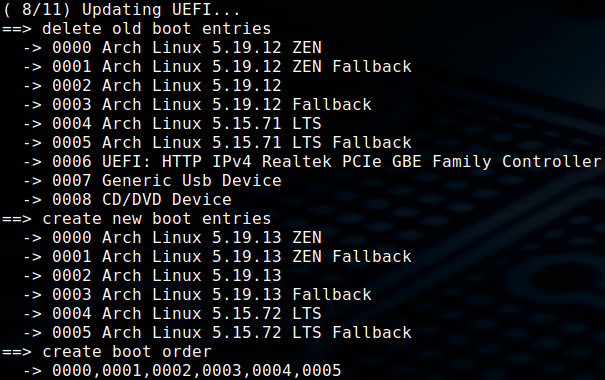

# efistub

shell script to create efi boot entries with efibootmgr

| folder name | comment                                                                 |
| :---------- | :---------------------------------------------------------------------- |
| entries     | config files for boot entries, the order of the files is the boot order |

| name         | comment                                                                       |
| :----------- | :---------------------------------------------------------------------------- |
| efistub.sh   | script that deletes all boot entries from efi and create new ones from config |

## config files

values and defaults:

- label=Linux
- disk=/dev/sda
- partition=1
- loader=/vmlinuz-linux
- options=

## related projects

- [pacman-hooks](https://github.com/mrdotx/pacman-hooks)
